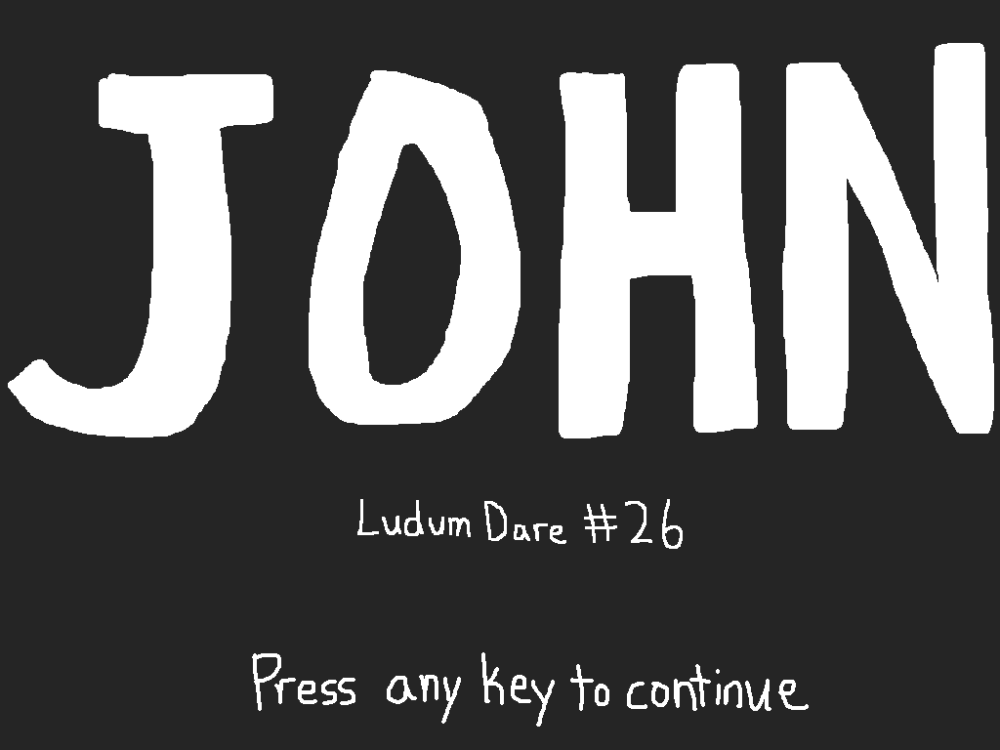

# [Ludum Dare 26: JOHN](http://ludumdare.com/compo/ludum-dare-26/?action=preview&uid=14296)
This was my entry for the Ludum Dare 26 Compo, which took place December 14th-17th 2012. The jam's theme was **You are the Villain**.

This game was built using [LÖVE](https://love2d.org/) 0.8.0.

Original submission description:

> In the spiritual successor to UNBOUND, JOHN, you play as as young boy caught in a terrible dream. You must escape the nightmare you have formed around yourself or lose yourself there forever.
>
> This game is a very short story game, spanning around 2 minutes. Stereo headphones with deep bass are recommended for the best audial experience.
>
> Additionally, the game runs at 1024x768. I may release a version with a wider aspect ratio, but lack of sleep and time have prevented it in time for the compo.

Original submission screenshots:

## License
JOHN is available under the terms of the MIT license. See [LICENSE.txt](LICENSE.txt) or <https://opensource.org/licenses/MIT> for details.